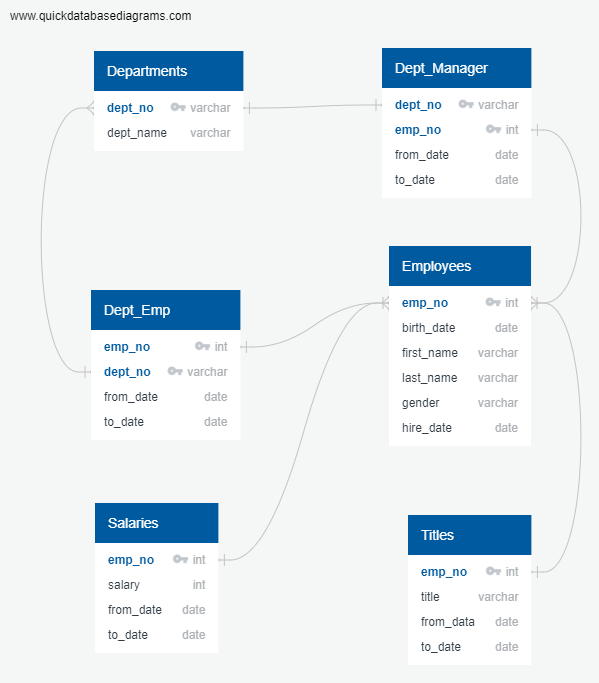
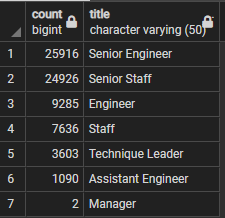
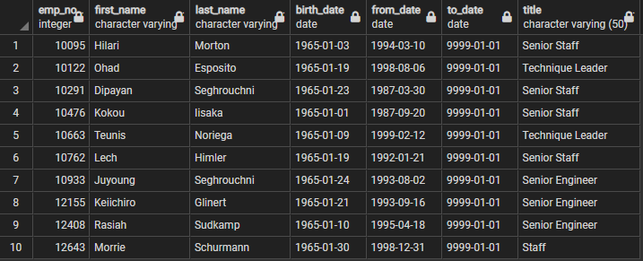

# Pewlett-Hackard-Analysis

## Overview of Project

The purpose of this project was to use PostgreSQL determine the number of retiring employees by title and identify empoyees who are eligible to partcipate in the mentorship program. An ERD commonly known as entity relationship diagram  is used to provide efficiency by showing the relationship between different tables.  Below is a snippet of the ERD we used for this project.

### Results

Below is a summary of the results based on the data provided as well as snippets to visualize employees eligible for the mentorship program as well as the number of retirement-age employees by most recent job title.

- The retirement_titles table visualizes all employees eligible for retirement and how long they hav held different positions within the organization.
- There were 72, 458 employees of retirement-age by most recent job title who were retrieved from the retirement titles table as well into the newly created unique_titles table.
- "DISTINCT ON" was used to to retrieve the first occurrence of the employee number for each set of rows defined by the "ON ()" to avoid duplicates which would provide inaccurate information.
- The last part of the project focused on creating a table that visualizes mentorship eligibility for employees who are eligible  to participate in the program.

### Summary

The company will need to replace over seventy thousand roles within the organization as the  silver tsunami bgins to take impact. Unfortunately, the mentorship program may not have enough mentors enough mentors for all the positions that will be vacant. However, the management can formulate a better plan to ensure that they bring in more employees who will cover the void.
